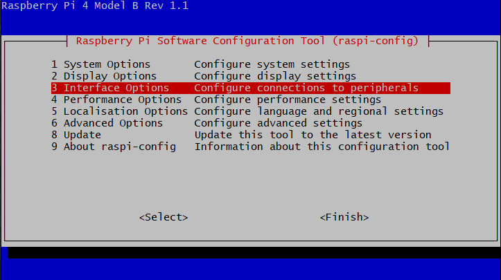

# WM1302 LoRaWAN Gateway Module

WM1302 module is a new generation of LoRaWAN gateway module with mini-PCIe form-factor. Based on the Semtech® SX1302 baseband LoRaWAN® chip, WM1302 unlocks the greater potential capacity of long-range wireless transmission for gateway products. It features higher sensitivity, less power consumption, and lower operating temperature than the previous SX1301 and SX1308 LoRa® chip. 

WM1302 LoRaWAN gateway module has SPI and USB versions on both US915 and EU868 frequency bands, enable you to have a wide-range of LoRaWAN frequency plans options to choose including EU868, US915, AS923, AS920, AU915, KR920 and IN865.

WM1302 module is CE, FCC and Telec certified, which helps simplify the development and certification process of the LoRaWAN gateway devices.

WM1302 is designed for M2M and IoT applications and can be widely applied in LPWAN gateway supported scenarios. It would be a perfect choice for you to significantly reduce the technical difficulties and time-consumption when developing the LoRa gateway devices, including LoRaWAN gateway, miner hotspots, etc.


## Getting Started

### Difference between SPI version and USB version

For WM1302 LoRaWAN Gateway Module SPI version, the Semtech SX1302 and SX126x chip are conntected to Raspberry Pi via the same SPI bus with different chip select(CS) pin.

For WM1302 LoRaWAN Gateway Module USB version, the Semtech SX1302 and SX126x chip are conntected to a STM32L4 MCU, and this factory programmed MCU will work as a USB device, becoming a bridge between Raspberry Pi and SX1302/SX126x.

### Quick Start with WM1302

#### Hardware Required

- WM1302 LoRaWAN Gateway Module

- Raspberry Pi boards with 40-pin GPIO header(e.g. Raspberry Pi 4B or Raspberry 3B+)

- WM1302 Pi Hat for Raspberry Pi

- Power Adapter for Raspberry Pi

- A LoRa antenna

- A 8G or larger SD card and a card reader

- A Type C USB cable if using WM1302 LoRaWAN Gateway Module USB version 

#### Software Required

- [Lastest Raspberry Pi OS image](https://www.raspberrypi.org/software/operating-systems/): Raspberry Pi OS Lite is recommended

- [Balena Etcher](https://www.balena.io/etcher/): To flash Raspberry Pi OS image to SD card

- [putty](https://www.putty.org/): To connect to Raspberry Pi via SSH on Windows

#### Step1. Mounting WM1302 Raspberry Pi Hat and install WM1302 module

It is easy to mount the Pi Hat on Raspberry Pi 40 Pin Header. Power off Raspberry Pi first, insert WM1302 module to the Pi Hat as the following picture and screw it down.


If USB version WM1302 module is using, please also connect its Type C port to the Raspberry Pi USB port with a Type C USB cable.


#### Step2. Enable the Raspbian I2C and SPI interface

WM1302 module communicates with Raspberry Pi with SPI and I2C. But these two interfaces are not enabled by default in Raspbian, so developer need to enable them before using WM1302. Here, we introduce a command line way to enable SPI and I2C interface.

First, login in Raspberry Pi via SSH or using a monitor(don't use serial console as the GPS module on the Pi Hat takes over the Pi's hardware UART pins), then type `sudo raspi-config` in command line to open Rasberry Pi Software Configuration Tool:

```
sudo raspi-config
```



1. Select `Interface Options`

2. Select `SPI`, then select `Yes` to enable it

3. Select `I2C`, then select `Yes` to enable it

4. Select `Serial Port`, then select `No` for "Would you like a login shell..." and select `Yes` for "Would you like the serial port hardware..."

5. After this, please reboot Raspberry Pi to make sure these settings work.

#### Step3. Get and compile SX1302 source code

Now let's install `git` and download `sx1302_hal`(library and programs for SX1302 LoRa Gateway) from github:

```
sudo apt update
sudo apt install -y git
cd ~
git clone https://github.com/Lora-net/sx1302_hal
```

Move to `sx1302_hal` folder and compile everything:

```
cd ~/sx1302_hal
make
```

#### Step4. Run Semtech SX1302 packet forwarder

Firstly, modify `reset pin` for SX1302 and SX1261 in `reset_lgw.sh` script, with text editor `nano`:

```
nano tools/reset_lgw.sh
```

The following code is shown at the head of text editor:

```
# GPIO mapping has to be adapted with HW
#

SX1302_RESET_PIN=23     # SX1302 reset
SX1302_POWER_EN_PIN=18  # SX1302 power enable
SX1261_RESET_PIN=22     # SX1261 reset (LBT / Spectral Scan)
AD5338R_RESET_PIN=13    # AD5338R reset (full-duplex CN490 reference design)
```

Use the navigation keys to move the cursor, change `SX1302_RESET_PIN=23` to `SX1302_RESET_PIN=25` and `SX1261_RESET_PIN=22` to `SX1261_RESET_PIN=17`, as following:

```
# GPIO mapping has to be adapted with HW
#

SX1302_RESET_PIN=25     # SX1302 reset
SX1302_POWER_EN_PIN=18  # SX1302 power enable
SX1261_RESET_PIN=17     # SX1261 reset (LBT / Spectral Scan)
AD5338R_RESET_PIN=13    # AD5338R reset (full-duplex CN490 reference design)
```

Save these changes by pressing `CTRL + x`, and then `y`, finally pressing `Enter` to close the text editor.

Copy `reset_lgw.sh` to `packet_forwarder` folder, then run `lora_pkt_fwd`. Please note that you should select a `global_conf.json.sx1250.xxxx` config file based on the module you are using:

```
cp tools/reset_lgw.sh packet_forwarder/
cd packet_forwarder

# Please select one of the following comands based on your module
# for WM1302 LoRaWAN Gateway Module (SPI) - EU868
./lora_pkt_fwd -c global_conf.json.sx1250.EU868

# for WM1302 LoRaWAN Gateway Module (USB) - EU868
./lora_pkt_fwd -c global_conf.json.sx1250.EU868.USB

# for WM1302 LoRaWAN Gateway Module (SPI) - US915
./lora_pkt_fwd -c global_conf.json.sx1250.US915

# for WM1302 LoRaWAN Gateway Module (USB) - US915
./lora_pkt_fwd -c global_conf.json.sx1250.US915.USB
```

Now, packet forwarder are able to run correctly. But there are still something to do if developers need to forward lora packet to their LoRa Server(e.g. TTN or chripstack). 

To achieve this target, developers must add the Raspberry Pi Gateway to Lora Server first. Take [TTNv3](https://www.thethingsindustries.com/docs/getting-started/) as an example, login [TTNv3 console](https://eu1.cloud.thethings.network/console), click `Go to gateways` and click `Add gateway`, in the `Add gateway` page you will find dozens of settings to fill. What you need to focus on are `Gateway EUI` and `Gateway Server address` and `Frequency plan`, the others just leave it to the default.

- `Gateway EUI`: A 64 bit extended unique identifier for your gateway, we set it to `AA555A0000000000` in this wiki

- `Gateway Server address`:  The server addresss which gateway will connect to, copy this to clipboard, developers need to save this to the config file later

- `Frequency plan`:  If using EU868 module, choose `Europe 863-870 MHz (SF9 for RX2)`, if using US915 module, choose `United States 902-928 MHz, FSB 2`


After adding gateway, back to the Raspberry Pi, press `CTRL + c` to stop `lora_pkt_fwd`, then edit the `global_conf.json.sx1250.xxxx` config file you used just now, with text editor `nano`:

```
# Please select one of the following comands based on your module
# for WM1302 LoRaWAN Gateway Module (SPI) - EU868
nano global_conf.json.sx1250.EU868

# for WM1302 LoRaWAN Gateway Module (USB) - EU868
nano global_conf.json.sx1250.EU868.USB

# for WM1302 LoRaWAN Gateway Module (SPI) - US915
nano global_conf.json.sx1250.US915

# for WM1302 LoRaWAN Gateway Module (USB) - US915
nano global_conf.json.sx1250.US915.USB
```

Basically, you only need to modify these parameters: `"server_address" "serv_port_up" "serv_port_down"`, which can be found at the tail of the config file. Copy `Gateway Server address` to `"server_address"`, change `"serv_port_up"` and `"serv_port_down"` to `1700`, these parameters should be edited like this: 

```
"gateway_conf": {
    "gateway_ID": "AA555A0000000000",
    /* change with default server address/ports */
    "server_address": "eu1.cloud.thethings.network",
    "serv_port_up": 1700,
    "serv_port_down": 1700,
```

Save these changes by pressing `CTRL + x`, and then `y`, finally pressing `Enter` to close the text editor. 

Restart `lora_pkt_fwd`, you will find your Raspberry Pi Gateway are conntected to TTNv3.

```
# Please select one of the following comands based on your module
# for WM1302 LoRaWAN Gateway Module (SPI) - EU868
./lora_pkt_fwd -c global_conf.json.sx1250.EU868

# for WM1302 LoRaWAN Gateway Module (USB) - EU868
./lora_pkt_fwd -c global_conf.json.sx1250.EU868.USB

# for WM1302 LoRaWAN Gateway Module (SPI) - US915
./lora_pkt_fwd -c global_conf.json.sx1250.US915

# for WM1302 LoRaWAN Gateway Module (USB) - US915
./lora_pkt_fwd -c global_conf.json.sx1250.US915.USB
```